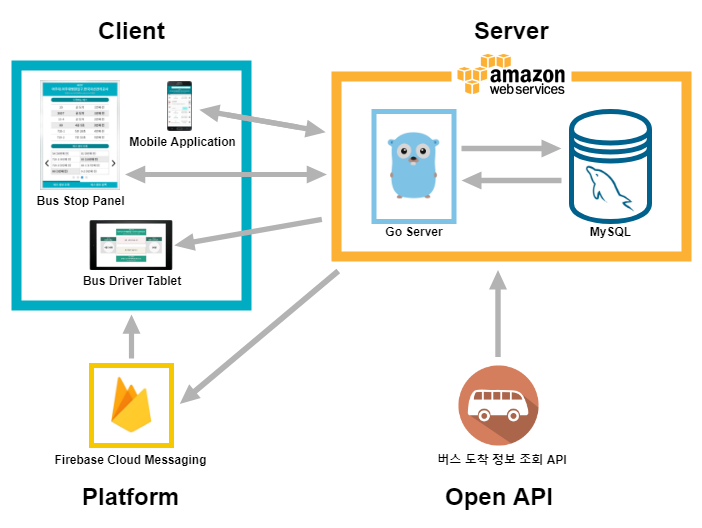
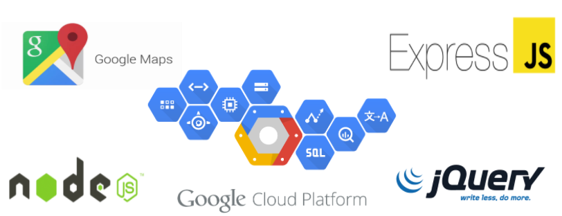
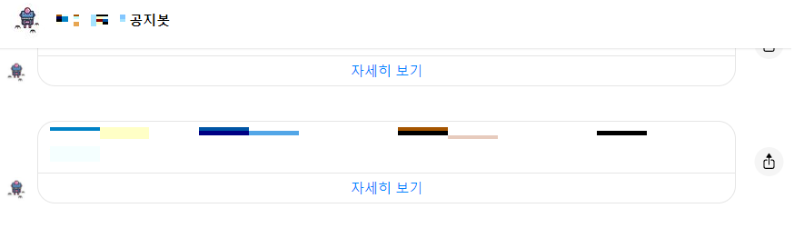

# portfolio

이 페이지에서 제가 참여했던 개발 프로젝트들을 소개합니다.

## 기술 스택

- 개발 언어
  - **Java**
  - **JavaScript**
  - C
  - Go
  - Node.js
- 라이브러리 / 프레임워크 / 
  - **Spring Boot (with Webflux)**
  - jQuery / jQuery UI
  - React
  - Electron
- 그 외
  - **Kubernetes(k8s)**
  - **Elastic Stack**
  - Kafka
  - MySQL
  - Redis

## 프로젝트 목록

- [RemoteFileSender (2020.02)](https://github.com/mjin1220/dev-log/#remote-file-sender-202002)
- [StopBus (2018.03 ~ 2018.06)](https://github.com/mjin1220/dev-log/#stop-bus-201803201806)
- [Air Bonobono (2018.03)](https://github.com/mjin1220/dev-log/#air-bonobono-201803)
- [ajou-noticer (2018.01 ~ 2018.03)](https://github.com/mjin1220/dev-log/#ajou-noticer-201801201803)
- [gongali (2017.11 ~ 2017.12)](https://github.com/mjin1220/dev-log/#gongali-201711201712)

## [Remote File Sender](https://github.com/mjin1220/RemoteFileSender) (2020.02)

`#go` `#sftp tool`

### 개요

Remote File Sender는 로컬에 있는 파일을 지정된 서버로 SFTP 기반 업로드를 제공하는 CLI기반 프로그램입니다. 개발을 하는 과정에서 개발 서버 내 여러 디렉토리에 파일을 옮겨줘야 하는 시간을 줄이고자 개발하게 된 프로그램입니다.

### 본문

개인적으로 편집하기 쉬운 방식의 설정파일을 이용하기 위해서 JSON 형식을 이용했고, 주로 VSCode에서 Remote Development를 이용하여 Terminal를 많이 이용하기 때문에 CLI기반으로 제작하게 되었습니다.

Config 파일은 크게 서버와 파일에 대한 정보를 가지고 있고, 이를 순차적으로 체크하면서 전송하고 그 결과를 출력해주고 있습니다.

실제로 사내에서 개발을 하면서 계속 사용하고 있으나, 사내에서 추가적으로 개발된 내용을 사외로 소스코드를 외부로 유출할 수 없어서 해당 Repository에는 최초로 구현된 기능들만 포함되어 있습니다.

> 포함되지 못한 기능: JSON Model 변경, 키워드 검색 기능

> TO-DO: 최근 이력 저장 기능, CLI UX 개선

## [Stop Bus](https://github.com/AJOU-Connection/StopBus_Server) (2018.03 ~ 2018.06)

`#go` `#android` `#javaFX` `#fcm`

### 개요

졸업작품으로 개발한 프로그램으로 비콘을 활용한 위치기반 승하차 예약 서비스입니다. Stop Bus는 정류장 터치 패널, 버스 기사용 Android App, 승객용 Android App으로 서비스가 제공됩니다.

주요 기능은 `정확도 높은 선착순 도착 버스 정보 제공`, `승하차 예약`, `승차 고객 알림`, `자동 하차벨 눌림`이 있습니다.

### 본문

Stop Bus 는 크게 4개의 Repository로 구성되어 있고, 서버와 3개의 인터페이스를 가집니다.

- [서버 Repository](https://github.com/AJOU-Connection/StopBus_Server)
- [승객용 Android App](https://github.com/AJOU-Connection/StopBus_User)
- [버스 기사용 Android App](https://github.com/AJOU-Connection/StopBus_Driver)
- [정류장 터치 패널](https://github.com/AJOU-Connection/StopBus_Panel)

전체적인 구조 는 다음과 같습니다.

  

시연 영상은 아래 유튜브 영상에 포함되어 있습니다.

저는 서버를 담당했으며, Go 언어를 이용하여 구현했습니다. 주요 기능은 다음과 같습니다

1. GBUS API를 사용하여 User, Diver, Panel로 실시간 버스정보 제공 - [공공데이터 포탈 API](https://www.data.go.kr/tcs/dss/selectDataSetList.do?keyword=%EB%B2%84%EC%8A%A4+%EB%8F%84%EC%B0%A9+%EC%A0%95%EB%B3%B4+) 활용
2. FCM(Firebase Cloud Messaging)을 활용한 Push 알람 제공 - 승하차 예약
3. 시연을 위한 가상의 버스, 노선

## [Air Bonobono](https://github.com/mjin1220/2018-GCPUG-bonobono) (2018.03)

`#nodejs` `#gcp` `#bigquery`

### 개요

Air Bonobono는 안전한 숙소 예약을 제공하는 웹 서비스 입니다. 범죄 데이터와 AirBnB의 숙소 데이터를 활용하여 안전한 숙소 예약을 할 수 있도록 서비스를 제공합니다.

주요 기능은 `검색한 결과에 따른 주변 숙소를 마커로 표시`, `범죄가 발생한 유형별 맵 표시`, `안전도를 고려한 최적의 숙박시설 Top 5 제공` 입니다.

### 본문

이 프로젝트에서 사용된 기술 스택은 아래와 같습니다.

  

저는 서버를 담당하여 GCP 위에서 BigQuery의 데이터와 DB에 저장된 데이터를 가공하여 GUI에 출력될 데이터를 전달했습니다. 그리고 GUI에 출력되는 부분까지 구현하고, 전반적인 서비스를 테스트하며 부족한 부분을 채웠습니다.

자세한 서비스 설명과 시연 영상은 아래 유튜브 영상에 포함되어 있습니다.

## [ajou-noticer](https://github.com/mjin1220/ajou-noticer) (2018.01 ~ 2018.03)

`#go` `#facebook` `#chatbot`

### 개요

ajou-noticer는 설정된 사이트에 공지사항이 업데이트 되면 facebook 채팅으로 알려주는 챗봇입니다. 웹 페이지를 주기적으로 크롤링하여 업데이트된 공지사항만 채팅으로 제목과 링크를 알려줍니다.

### 본문

주기적으로 대학교 페이지에 들어가서 공지사항을 확인해야하는 것이 불편했습니다. 사이트에 공지사항이 업데이트되면 자동으로 알려주는 SW가 있으면 좋겠다고 생각을 했고, Facebook 챗봇 API를 이용하여 개발했습니다.

  

## [gongali](https://github.com/mjin1220/gongali) (2017.11 ~ 2017.12)

`node.js`

### 개요

gongali는 공공시설 조회/예약 서비스입니다.

공공기관에서 예약제로 제공하는 체육관, 회의실 등의 시설을 쉽게 이용하지 못하여 공실로 허비되는 시간이 많다는 것을 깨닫게 되었습니다. 또한, 공공시설을 관리하는 각 지자체 사이트에 들어가서 예약을 해야되는 것에서 불편함이 있다고 생각했습니다. 그래서 공공시설에 대한 통합 데이터를 만들고, 예약 서비스를 제공하고자 했습니다.

주요 기능은 `회원가입/로그인`, `위치기반 조회`, `키워드 조회`, `공공시설 예약/조회` 입니다.

### 본문

gongali는 Node.js 기반 서버를 이용하여 구축되었고, [공공데이터 포털에 게시된 공공시설 현황 데이터](https://www.data.go.kr/data/15013117/standard.do)를 활용했습니다.

저는 회원가입/로그인 기능을 개발했습니다. 매 트랜잭션마다 세션의 유무를 판단하여 비정상적인 접근을 막고, 로그인된 상태에서만 예약을 할 수 있도록 개발되었습니다.

시연 영상은 아래 유튜브 영상에 포함되어 있습니다.

